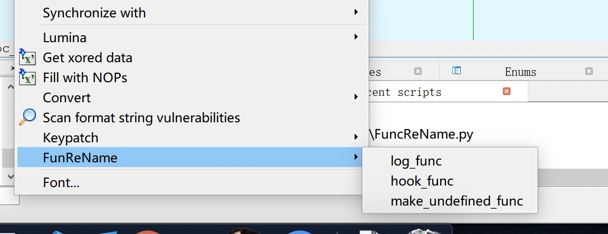
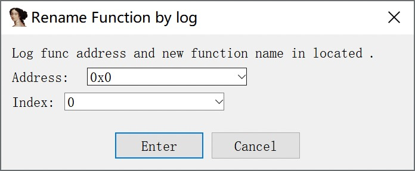
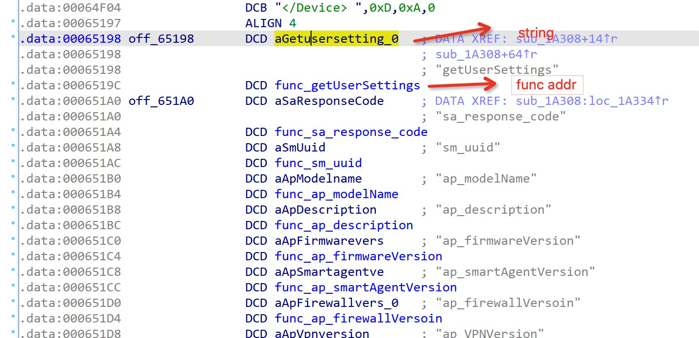
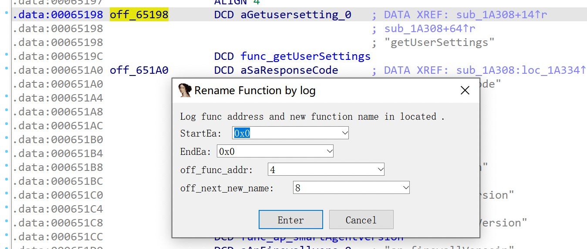

## mipsrop

support IDAPython 7.4 and Python3

## hexrays_hight

support Python3

## uEmu

support Python3 and add a reset button.

## FuncReName

用来重命名函数的插件

三个功能

**1.log_func**

通过打印的日志的函数来给函数重命名，两个参数

一个是 **log** 函数的地址， 一个的以 **log** 函数的哪个参数作为新的函数名（从 0 开始算）

**2. hook_fun**

通过 ** handle** 函数来重命名，例如下面的这种情况

传入的参数有 4 个

StartEa 和 EndEa 分别是开始的地址和结束的地址 （以第一个 string 开始）

off_func_addr 表示起始地址距离函数的偏移，例如这是 4

off_next_new_name 表示下距离一个字符串的偏移，例如此时是 8

**3. Make_undefined_func**

暴力的对所有函数进行 `P` 操作，即`makefunc`